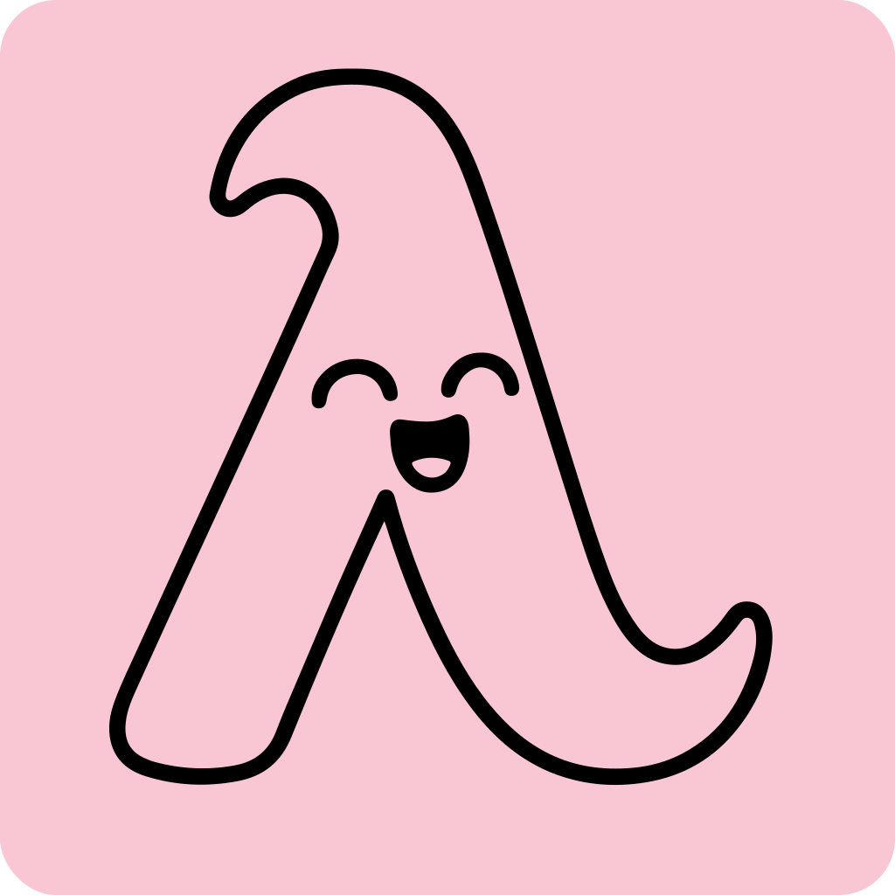
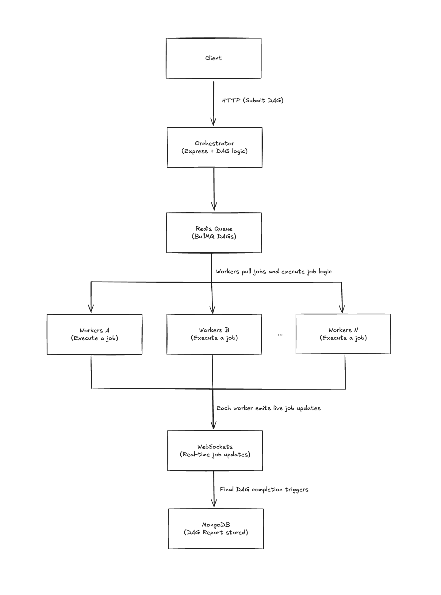

# 🛠️ MiniLambda

  

## Overview

A job orchestrator allowing developers to submit multi-step, multi-model, dependency-based AI/LLM job pipelines. After the entire pipeline is executed, a report is generated about the overall success or failure of the pipeline, as well as each job's results.

## Features

- DAG-based pipeline execution
- Redis-backed job queue with BullMQ
- MongoDB-powered job reporting
- Status tracking (success, failure, skipped)
- Extensible architecture for custom job types

## Architecture

